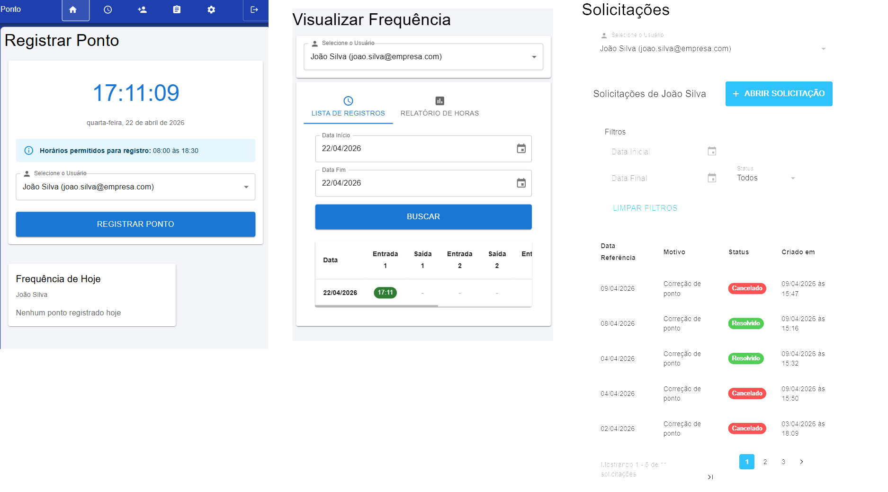

# PontoEletronico

Uma aplicação para gerenciar o ponto eletrônico

<!-- Você pode adicionar um logo/banner aqui -->
<!--  -->

## 📸 Screenshots



<!-- Adicione mais capturas de tela aqui -->
<!--  -->
<!--  -->

## 🚀 Tecnologias

### Frontend
- React + TypeScript
- Vite
- CSS

### Backend
- Java + Spring Boot
- Maven
- PostgreSQL

## 📋 Funcionalidades

- ✅ Registro de ponto
- ✅ Visualização de pontos
- ✅ Gerenciamento de usuários
- ✅ Sistema de solicitações
- ✅ Autenticação customizada

## 🔧 Como usar

### Para adicionar imagens ao README:

1. **Crie uma pasta para assets** (se não existir):
   ```
   mkdir assets
   mkdir assets/screenshots
   ```

2. **Adicione suas imagens** na pasta criada

3. **Use a sintaxe Markdown**:
   ```markdown
   
   ```

## 📁 Estrutura do Projeto

```
PontoEletronico/
├── frontend/          # Aplicação React
├── mvcpontoeletronico/ # API Spring Boot
├── assets/            # Imagens e recursos
│   ├── logo.png
│   └── screenshots/
└── README.md
```
